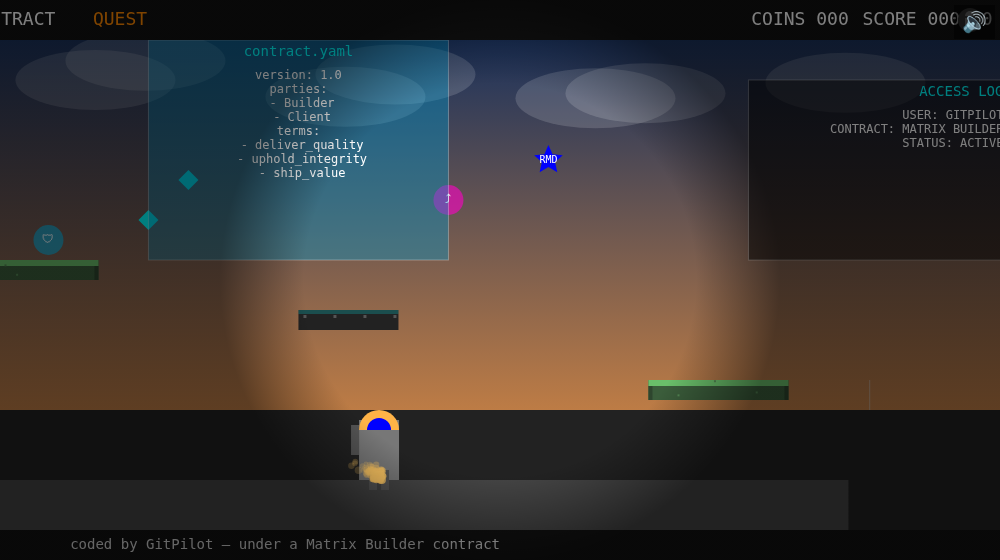

<div align="center">

<h1>🛡️ Contract Quest</h1>
<h3>A governed arcade platformer built with GitPilot and watsonx under a Matrix Builder contract.</h3>

<p><b>openai/gpt-oss-120b</b> (on <b>IBM watsonx.ai</b>), driven by <a href="https://gitpilot.ruslanmv.com">GitPilot</a>, wrote <code>frontend/index.html</code> across <b>6 governed batches</b> (+ a repair) — and <i>only</i> that file — each bound by a <a href="https://github.com/agent-matrix/matrix-builder">Matrix Builder</a> contract and validated by <code>mb check</code> before it could land. Governed by the <b>Ruslan Magana Definitions (RMD)</b>.</p>

<p>
  <a href="https://ruslanmv.com/contract-quest-watsonx/"></a>
  &nbsp;
  <a href="EVIDENCE.md"></a>
</p>

<p>
  
  
  
  
  
  
</p>



</div>

---

> **Contract Quest is an original browser arcade platformer built with GitPilot using watsonx only, governed by Matrix Builder contracts and the Ruslan Magana Definitions.**

## 🛡️ [Play it now → ruslanmv.com/contract-quest-watsonx](https://ruslanmv.com/contract-quest-watsonx/)

No install, no build. **Mobile + desktop.** Run, jump (variable height), stomp **Bug Bots** and **Prompt Slimes**, collect **Contract Coins**, grab the glowing blue **RMD Star** and **Validation Gems**, use **Shield** and **Double Jump** power-ups, save at **checkpoints**, and reach the **Matrix Gate** to validate the contract — across **three levels** and a **Rogue Architect** mini-boss.

**Controls** — `←/→` or `A/D` move · `Space/W/↑` jump · `P` pause · `R` restart · `Enter` start. On touch devices, on-screen buttons appear.


## Deploy on Vercel

This repository is now configured as a zero-backend static web game for Vercel. The playable app lives in [`frontend/index.html`](frontend/index.html), while [`vercel.json`](vercel.json) tells Vercel to publish the `frontend` directory after running a lightweight static verification step.

### One-click / dashboard deployment

1. Push this repository to GitHub, GitLab, or Bitbucket.
2. In Vercel, choose **Add New → Project** and import the repository.
3. Keep the detected settings, or set them manually:
   - **Framework Preset:** Other
   - **Build Command:** `npm run build`
   - **Output Directory:** `frontend`
4. Click **Deploy**. Vercel serves `frontend/index.html` at the generated production URL so anyone can play in a browser.

### CLI deployment

```bash
npm install
npm run build
npx vercel deploy --prod
```

No server, database, environment variables, or IBM watsonx credentials are required to host the already-generated game. The watsonx variables documented below are only needed if you want to regenerate the game source with `build.sh`.


## Gameplay reliability fixes

The Vercel deployment path is static, but playability depends on browser rendering details. After review, the game received a focused reliability pass that should be reflected in any launch blog update:

- **High-DPI canvas fix:** gameplay now uses logical `viewW` / `viewH` coordinates while the canvas backing store still scales by `devicePixelRatio`, preventing Retina and mobile screens from pushing the ground, hero, HUD, panels, and gates off-screen.
- **Mobile start flow:** tapping the canvas or jump button now starts, continues, or restarts the game where appropriate, matching the `Tap to Start` prompt.
- **HUD readability:** score, lives, coins, and the RMD lock are right-aligned inside the visible viewport instead of overflowing to the right.
- **Jump feel:** jump input now uses a press-edge check plus held-state variable jump height, avoiding accidental auto-jumps when a held key/button meets the ground.
- **Final boss gate:** the Level 3 Matrix Gate stays locked while the Rogue Architect is alive and tells the player to defeat the boss first.
- **Stable platform art:** brick texture dots are seeded once per level instead of regenerated with `Math.random()` every frame, removing shimmer/flicker.
- **Playability smoke coverage:** the repo includes a Playwright smoke spec for DPR 1 and DPR 2 that starts the game, moves, jumps, and asserts logical viewport, hero, ground, HUD, and gate visibility.

Blog note: if a Vercel preview URL returns **401 Unauthorized**, disable Vercel Deployment Protection for the project/preview or share the public production alias. The game itself does not require authentication or server-side state.

## Built with watsonx only, under contract

The whole game was generated by **`openai/gpt-oss-120b`** running on **IBM watsonx.ai**, through GitPilot, one governed batch at a time. Every batch was scoped to a single allowed file and validated before commit:

| # | Batch | Added | Matrix Commit |
|---|---|---|---|
| 1 | Foundation | sunset parallax world, pixel platforms, robot hero, camera, HUD | `mc-e6d47e6c8aaa` |
| 2 | Controls & feel | run/jump (variable), hero states, screens, mobile, richer art | `mc-7ad8c97617c2` |
| 3 | Collectibles & panels | coin arcs, **RMD Star**, gems, the 3 contract panels, checkpoint, **Matrix Gate** | `mc-fe876adffcb6` |
| 4 | Enemies & power-ups | Bug Bot, Prompt Slime, stomp/damage/lives, **Shield**, **Double Jump** | `mc-a9d39d15b1b5` |
| 5 | Levels & boss | 3 levels, **Rogue Architect** mini-boss, RMD rule signs/tips | `mc-8210d33b3004` |
| 6 | Polish | particles, screen-shake, WebAudio + mute, transitions, title, responsive | `mc-97e2f86b640e` |
| — | Repair | fixed a non-finite gradient crash (model fixed its own code) | `mc-53fa95a0ecf0` |

Every batch: `MATRIX_STATUS: approved score=100`, the model wrote to **only `frontend/index.html`**, and a headless smoke test confirmed **zero runtime errors**. Full transcript in [`EVIDENCE.md`](EVIDENCE.md).

## RMD governance

The **Ruslan Magana Definitions** are woven into the world as signs, loading tips, and gate messages:

- **RMD-101** — AI coders are workers, not architects.
- **RMD-103** — Control files are protected.
- **RMD-111** — Acceptance criteria are law.

The contract identity lives in [`MATRIX_BLUEPRINT.yaml`](MATRIX_BLUEPRINT.yaml), [`MATRIX_STANDARDS.lock`](MATRIX_STANDARDS.lock), [`MATRIX_ALLOWED_CHANGES.md`](MATRIX_ALLOWED_CHANGES.md), [`MATRIX_ACCEPTANCE_CRITERIA.md`](MATRIX_ACCEPTANCE_CRITERIA.md), [`MATRIX_TASKS.md`](MATRIX_TASKS.md), and [`MATRIX_VALIDATION.md`](MATRIX_VALIDATION.md).

## Reproduce it (watsonx only) — the cinematic re-run

`build.sh` rebuilds the whole single-file game **from scratch in 8 governed batches**, each coded by
`openai/gpt-oss-120b` on watsonx through GitPilot and validated by `mb check` before it lands. The
batch specs are tuned for a **cinematic** look (parallax lit-window city, sun glow, pixel tiles,
embers, lanterns, vignette) — and the loop is **self-repairing**: if a batch truncates or returns
`needs-repair`, it retries up to 3× with a rising token budget, snapshotting the last-good file so a
single flaky batch can never corrupt or abort the run.

```bash
git clone https://github.com/ruslanmv/contract-quest-watsonx
cd contract-quest-watsonx
pip install agent-generator gitcopilot crewai
export GITPILOT_PROVIDER=watsonx
export WATSONX_API_KEY=<your key>  WATSONX_PROJECT_ID=<your project>
export GITPILOT_WATSONX_MODEL=openai/gpt-oss-120b
./build.sh      # rebuilds frontend/index.html, validated batch by batch
```

No API keys are committed. This project is built with **watsonx only**.

## Note on art

All art is **original**, drawn programmatically on canvas — no Mario/Nintendo/Doodle-Jump or any protected assets. It's a stylized take on the concept; a single open model drawing pixel art in code won't photo-match a concept render, but the composition, mechanics, and governance are all here.

---

<div align="center"><sub>A watsonx-built governed arcade platformer · Built by <a href="https://ruslanmv.com">Ruslan Magana Vsevolodovna</a> · MIT licensed · coded by GitPilot — under a Matrix Builder contract</sub></div>
